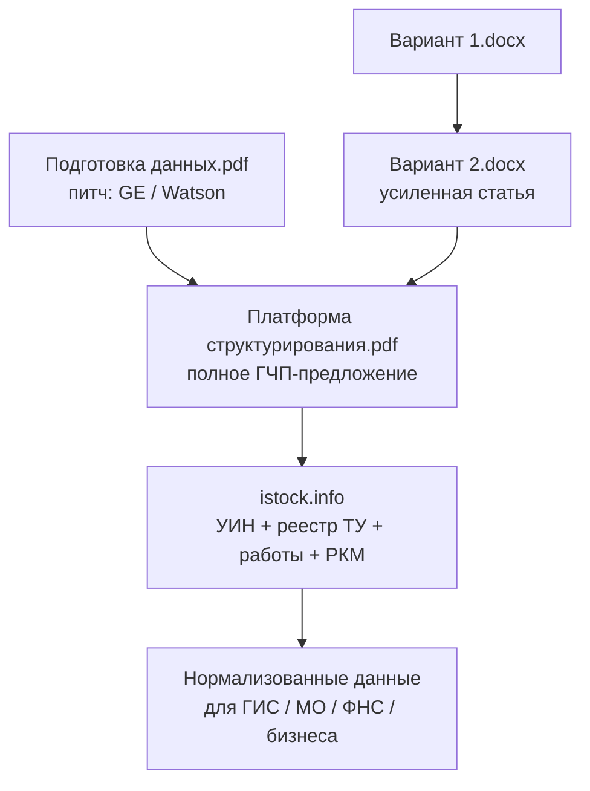

# Анализ документов: платформа структурирования данных

Дата разбора: 2026-08-10  
Источники: 2 PDF + 2 DOCX (см. `README.md`).

## Краткий вердикт

Пакет описывает **одну продуктовую линию** вокруг **istock.info** (АО «Компрессор» / «Компрессор Газ»):

1. **Проблема** — фрагментация номенклатурных справочников (КТРУ, ГИСП, «Честный ЗНАК», ERP и т.д.): один товар = разные коды и описания.
2. **Решение** — межотраслевая платформа нормализации («единое окно») с параметрическим описанием ТЗ/ТУ/ОЛ и идентификатором **УИН** (не путать с маркировкой / серийником).
3. **Масштаб амбиции** — от реестра ТУ и работ до РКМ, контроля ГОЗ/ГЗ, межотраслевого баланса и цифрового двойника кооперационных связей РФ.
4. **Два DOCX** — это **публицистические / экспертные варианты** обоснования проблемы для власти и бизнеса; **Вариант 2** сильнее как текст для публикации.

---

## Документ 1. `Платформа_Подготовка_данных.pdf`

Короткий питч (логика «почему данные важнее объёма»).

| Блок | Суть |
|------|------|
| Ценностный барьер PLM | Эволюция CAD → PDM → цифровые двойники / CAE+AI; без подготовки данных ценность ИИ не раскрывается |
| Кейс GE | Data lakes → «болота данных»; объём ≠ польза |
| Кейс IBM Watson Oncology | ИИ без эталонных данных → опасные рекомендации, закрытие проекта |
| Методология istock.info | Систематизация сложных ТЗ по разным стандартам в параметрическом виде; апробация на промышленных изделиях |
| Предложение | ПК подготовки эталонных нормализованных данных для ИС исполнительной власти и ИИ/ML |
| Направления данных | Изделия, работы/услуги, техпроцессы, компетенции, материалы, КД, патенты/НИОКР, потребности в технологиях |

**Роль в пакете:** «заход» для ЛПР: сначала убедить в ценности подготовки данных, потом вести к полной платформе.

---

## Документ 2. `Платформа_структурирования_данных.pdf`

Полное коммерческое / ГЧП-предложение (~37 слайдов, визуальный PDF → текст через OCR в `extracts/`).

### Цель и формат

- **Цель:** нормализованные данные для ИС исполнительной власти (учёт МЦ, бюджет, налоги, планирование).
- **Форма:** государственно-частное партнёрство.
- **База:** уже существующий продукт **istock.info** (реестр оцифрованных ТУ + каталог работ/услуг).
- **Финансовый ориентир на слайде:** прибыль проекта до налогообложения порядка **миллиардов ₽/год** (в OCR/рендере встречаются расхождения цифр — сверять с исходным слайдом).

### Архитектура (ядро)

1. **Всероссийский реестр ТУ**  
   Оцифрованные ТУ, номенклатура, эксплуатационные документы; публичная / закрытая часть (комтайна).  
   Каждому варианту исполнения — **УИН** (конструктивные, нормативные, экономические характеристики; не серийник и не аналог «Честного ЗНАКа»).

2. **Модуль работ / услуг / техкарт**  
   Единый реестр работ с трудоёмкостью, компетенциями, оснасткой; проверка РКМ по ГОЗ/ГЗ; оцифровка строительных смет.

3. **Централизованная обработка данных из учётных систем**  
   Без смены бухучёта: в УПД/сметы добавляется УИН; за ~3 цикла — РКМ по изделиям, рост точности; «котловой» учёт не блокирует модель.  
   Результат: граф кооперации (ИНН ↔ УИН ↔ РКМ/сметы).

### Заявленные эффекты для государства

- Контроль целевого использования средств по ГЗ/ГОЗ  
- Всероссийский реестр РКМ  
- Данные для межотраслевого (и межрегионального) баланса  
- Референтные цены с климатическими/региональными поправками  
- Выявление импортных комплектующих, подтверждение происхождения (ПП-719)  
- Планирование заказов ОПК на горизонте 1–10 лет, проектное финансирование ниже ключевой ставки (как идея механизма)

### Статус зрелости (по слайду roadmap / статусов)

| Направление | Заявленный статус |
|-------------|-------------------|
| Идентификация промтоваров | Промэксплуатация; наполнение БД (в материале — порядка сотен млн описаний изделий/стандартов на фев 2026) |
| Работы и услуги | Разработано / к внедрению |
| Нормализация / декомпозиция / закупки / заказы / ТОиР / экспл. документация | Промэксплуатация (+ обучение ИИ-помощников) |
| Оцифровка цепочек поставок | Готово к промэксплуатации (матмодели) |
| Реестр ТУ «под защиту данных» | Подготовлено, нужна доработка требований защиты |

### Доверие / инвестиции (заявлено)

- В реестре отечественного ПО (Минцифры), сервера в РФ  
- > **400 млн ₽** собственных инвестиций за ~5 лет  
- Сравнение с каталогами ГИСП / «Честный ЗНАК» / Казахстан и др. — в приложениях (таблицы)

**Роль в пакете:** основной «тяжёлый» документ для переговоров с ведомствами / ГЧП.

---

## Документ 3–4. `Вариант_1.docx` и `Вариант_2.docx`

Оба — аналитика про **несовместимость номенклатурных справочников** и предложение **нормализующей платформы «единое окно»**. Источник: открытые данные + ИИ (указано в тексте).

### Общая структура

1. Области применения справочников (САПР, ERP, ТОиР, ЭТП/КТРУ, логистика, НСИ…)  
2. Системные проблемы ненормализованных данных  
3. Разбор РФ: «Честный ЗНАК», КТРУ, ГИСП  
4. Международный контекст (ЕС eClass, США, Китай)  
5. Барьеры единого стандарта (регуляторы, ERP, бизнес, право, термины)  
6. Предложение платформы нормализации

### Чем Вариант 2 сильнее

| Критерий | Вариант 1 | Вариант 2 |
|----------|-----------|-----------|
| Введение | Короче, «академичнее» | Жёстче формулирует ущерб государству / бизнесу / IT |
| Конкретный пример | Нет | Таблица «Гвоздь 3×25» в ГИСП / КТРУ / ЧЗ / 1С / ТН ВЭД |
| Таблицы | 2 | 6 (сферы, пример, проблемы, страны, эффекты, аббревиатуры) |
| Решение | Общее «единое окно» | То же + явная альтернатива «очередному супер-каталогу» |
| Глоссарий | Нет | Есть (ГИСП, КТРУ, ОКПД2, УИН, MDM…) |
| Тон для публикации | Черновик / внутренняя записка | Ближе к статье / policy brief |

**Рекомендация:** для внешней коммуникации опираться на **Вариант 2**; Вариант 1 — как черновик / запасной каркас.

---

## Связь документов между собой

- PDF «Подготовка» и полный PDF **согласованы по тезису**: без эталонных данных ИИ и госсистемы не работают.  
- DOCX **обосновывают рыночную/ведомственную боль** (КТРУ/ГИСП/ЧЗ), на которую полная платформа отвечает архитектурой УИН + нормализация.  
- УИН в DOCX (Вариант 2, глоссарий) = тот же концепт, что в полном PDF.

---

## Сильные стороны предложения

1. **Чёткая постановка проблемы** фрагментации справочников — узнаваема для бизнеса и ведомств.  
2. **Не «ещё один каталог»**, а слой нормализации / MDM поверх существующих ИС.  
3. **Параметрическое описание** + УИН — понятная техническая ось интеграции с ОКПД2, ТН ВЭД, КТРУ, ERP.  
4. **Минимальное вмешательство в бухучёт** (добавить УИН в УПД) — снижает сопротивление предприятий.  
5. Есть **живой продукт** (istock.info) и заявленная промэксплуатация части модулей.  
6. Связка с **Link / istocklink**-контуром лендинга в этом репозитории логична по бренду и предметной области (промзакупки, ТЗ, агрегация).

---

## Риски и пробелы (что уточнить перед использованием)

1. **Цифры и статусы** в полном PDF нужно верифицировать по первоисточнику (OCR слайдов не идеален; финансовые ориентиры и объёмы БД — чувствительные заявления).  
2. **Юридическая модель ГЧП** и оператор данных (кто владеет УИН, кто обязан подавать данные) в текстах заявлены идеей, без детального регламента.  
3. **Безопасность / гостайна / ГОЗ**: «доработка защиты данных» для реестра ТУ — критичный gap для МО/ОПК.  
4. **Стимулы бизнеса**: без обязательности или явной выгоды «одно окно» может не наполниться (это же сами DOCX называют барьером).  
5. **Смешение уровней**: от MDM-номенклатуры до межотраслевого баланса и проектного финансирования — широкий scope; для пилота нужен **узкий вертикальный срез** (например: один отраслевой сегмент + один контур ГОЗ/ГИСП).  
6. DOCX помечены как анализ с помощью ИИ по открытым источникам — для официальной подачи нужна **редактура фактов и ссылок**.

---

## Практические следующие шаги (если развивать в репозитории / продукте)

1. Зафиксировать **канонический narrative**: проблема (Вариант 2) → ценность данных (короткий PDF) → решение (полный PDF).  
2. Выделить **MVP-контур**: УИН + параметрическая карточка изделия + выгрузка в 1–2 целевые системы (например КТРУ/ГИСП или внутренний ERP).  
3. Свести **глоссарий** из Варианта 2 и полного PDF в единый `docs/platform/glossary.md`.  
4. Отдельно проработать **landing / one-pager** под ГЧП без перегруза архитектурой (короткий PDF как основа).  
5. Для инженерной проработки — схема данных УИН ↔ ОКПД2/ТН ВЭД/GTIN и API нормализации (в этих файлах — концепт, не спецификация API).

---

## Итог одной фразой

Документы описывают **национальный слой Master Data / нормализации номенклатуры на базе istock.info (УИН + параметрика ТУ/работ)**, упакованный как ГЧП-предложение для исполнительной власти; аналитические DOCX готовят почву под эту идею, а полный PDF раскрывает продуктовую и управленческую архитектуру — с сильной постановкой проблемы и широким, требующим приоритизации, scope эффектов.
